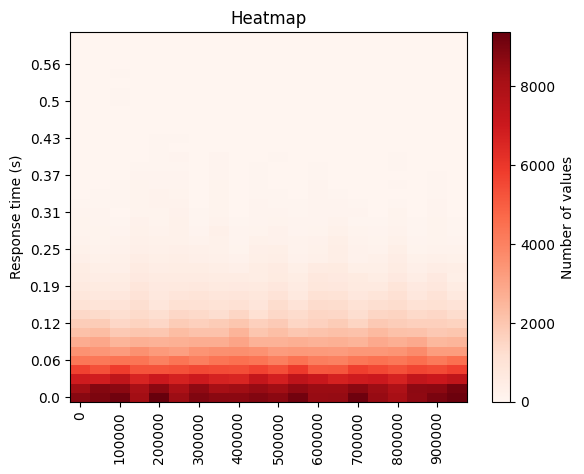
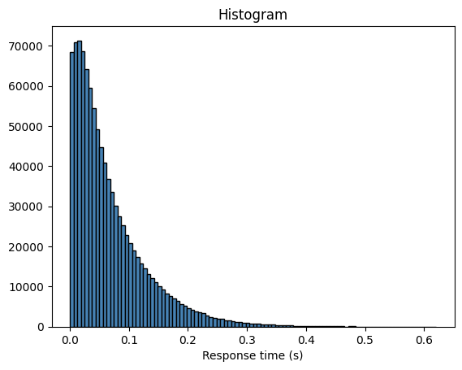
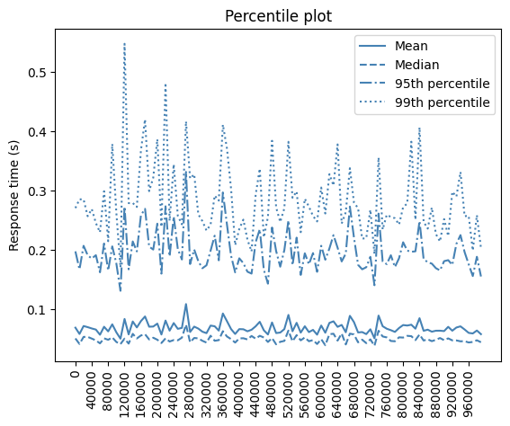
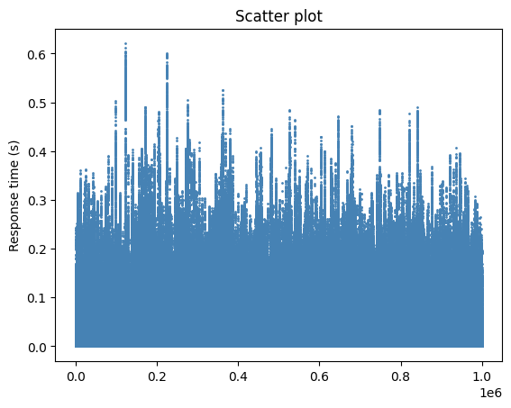

Lab report: capacity planning and performance analysis with SimPy
========================================================================

> [!NOTE]
> Write your report in this document. You can write it in English or French

Result table
------------

This table documents the results of the different simulation scenarios

| Case                                                   | Required service rate| Mean service time | Response time      |
|--------------------------------------------------------|----------------------|-------------------|--------------------|
| 1a. Base scenario: $\lambda = 90/s$                    | $\mu = 100 /s$       | $1/\mu$ = 9.8 ms  | mean: 100 ms       |
| 1b. M/M/1 model for $\lambda = 180/s$                  | $\mu = 190 /s$       | $1/\mu$ =  5 ms   | mean: 100 ms       |
| 2a. Batch arrivals with $\lambda_\text{file} = 90$/s    | $\mu = 126 /s$       | $1/\mu$ = 7.9  ms | mean: 100 ms       |
| 2b. Batch arrivals with $\lambda_\text{file} = 180$/s   | $\mu = 216 /s$       | $1/\mu$ = 4.6  ms | mean: 100 ms       |
| 3a. Batch arrivals with $\lambda_\text{file} = 90$/s    | $\mu = 143 /s$       | $1/\mu$ = 7  ms   | 99th perc.: 300 ms |
| 3b. Batch arrivals with $\lambda_\text{file} = 180$/s   | $\mu = 234 /s$       | $1/\mu$ = 4.3 ms  | 99th perc.: 300 ms |

Case 1a: Base scenario
----------------------

Scenario

- M/M/1 model
- $\lambda = 90$ requests per second
- Target response time $E[t] = 100$ ms

Use the analytical model to compute required service rate $\mu$. Report the value in the table on top.

Case 1b: Doubling the arrival rate
----------------------------------

Use the same scenario as in Case 1a, but double the arrival rate $\lambda$.

Use the analytical model to compute the required service rate $\mu$. Report it in the table on top.

**Question**: does the service rate need to double, too? Interpret the result.

No there is no need to double the service rate as well. The mean response time is matched by just increasing the service rate by the difference between the old arrival rate and the new one.

Case 2a: Batch arrivals
-----------------------

Simulate the model with batch arrivals and an arrival rate of Web pages (not file requests) of $\lambda = 90$ web requests per second.

Which service rate is required to achieve a mean response time of $E[t] = 100$ ms. Report this result in the table on top.

**Question**: interpret this result!

Service rate needs to be higher than in point 1a due to the fact that file downloads are now queuing. In the previous cases tasks were arriving one by one.

Case 2b: Batch arrivals and double arrival rate
-----------------------------------------------

Determine the service rate \$mu$ that is required if the arrival rate of Web pages doubles and we want to achieve a response time of 100 ms.

Report this result in the table on top. Interpret the result.

Service rate also needs to be higher. We can observe that the difference between the new service rate and the previous one is the same difference than the one between the service rates between points 1a and 2a. This means that 26 is the consequence of a mean queue of 5.

Case 3a: Batch arrivals and 99th percentile
-------------------------------------------

Determine the service rate $\mu$ that is required such that the 99th percentile of the response time is around 300 ms.

Report this result in the table on top. Interpret the result.

Again, we have to increase service rate to match 300ms 99th percentile respoonse time. This time we add 18 to it. This amount should be also added to the next point to match the 300ms 99th percentile response time. By doing this step we can see what it takes to handle the worst cases.

Case 3b: Batch arrivals, double arrival rate and 99th percentile
----------------------------------------------------------------

Determine the service rate \$mu$ that is required if the arrival rate of Web pages doubles such that the 99th percentile of the response time is around 300 ms.

Report this result in the table on top.

Visualization
-------------

Use the plot functions defined in the file `visualization/plots.py` to visualize the response time distribution for the case 3b (Batch arrivals, double arrival rate and 99th percentile).

Include each plot in this report and interpret the results.

In the heat map we can observe the repartition of our response times. There is any notable peak so the trafic is treated normally throughout the simulation.

Here, the histogram shows the distribution of our response times. We can deduct that our response times are mostly under 200 ms in general.

In this plot we can observe that both median and mean response times are under 100 ms. On the other hand, we can see that 95th percentile is around 200 ms response time and 99th response time is around 300 ms. Those numbers are normal given the fact that they represent the worst cases.

To conclude, we have the scatter plot that shows response time for each file downloaded. With this plot we can check if all peaks are grouped to determine if there was an issue for example. It is not the case here.

Conclusion
----------

Document your conclusions here. What did you learn from the simulation results?

During this lab I learnt how can queues influence the delays of treatment and how good service rates are important. 
I could observe the impact of batch arrivals, how they impact the response times and how service rates need to be changed to satisfy a good service.
I also became contious on how useful it is to generate plots to analyse the delays and detect potential treatment issues or potential bottlenecks.
Overall, this lab reinforced the importance of good simulations to anticipate and optimise system treatment behaviour under changing conditions.
